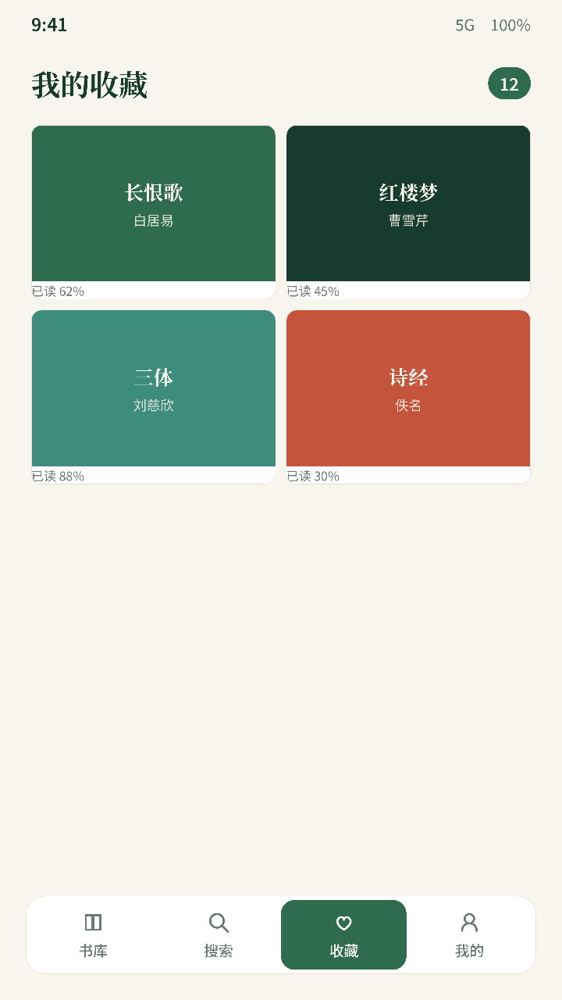
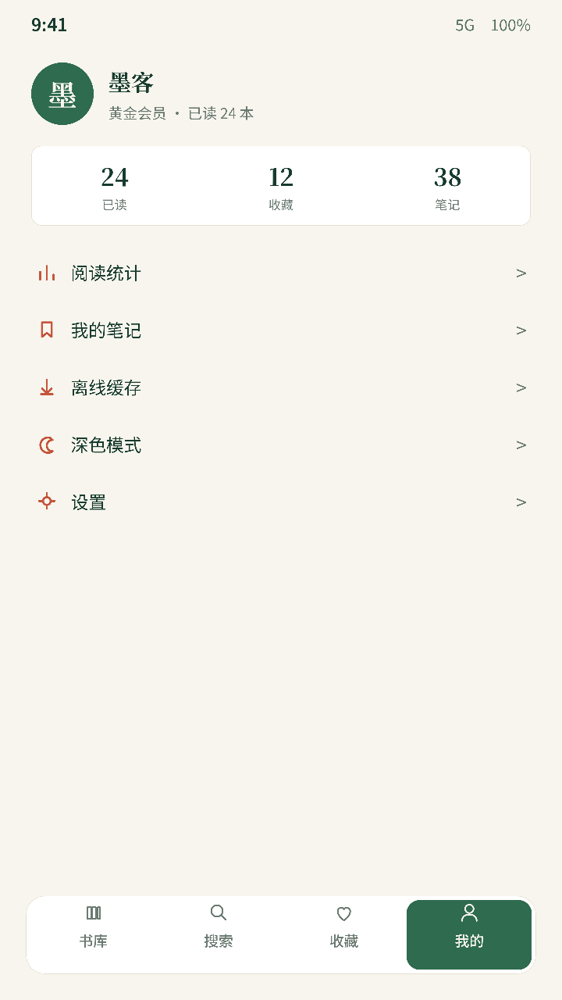

**English** | [简体中文](README_zh.md) | [Türkçe](README_tr.md) | [Русский](README_RU.md)

 

  

<h1 align="center">松江阅 · SongJiang Reader</h1>

<em>Forked from <a href="https://github.com/Anxcye/anx-reader">Anxcye/anx-reader</a></em>

  
  

松江阅 (SongJiang Reader), a thoughtfully crafted e-book reader for book lovers. Featuring powerful AI capabilities and supporting various e-book formats, it makes reading smarter and more focused. With its modern interface design, we're committed to delivering pure reading pleasure.

| Feature | Details | Status |
| --- | --- | --- |
| Format Support | EPUB/MOBI/AZW3/FB2/TXT/PDF fully supported | ✅ |
| Cross-Platform Sync | Android/iOS/macOS/Windows coverage Sync books, notes, and reading progress via WebDAV | ✅ |
| AI Assistant | Organizes shelves by progress and tone Generates mind maps for deeper understanding On-demand AI dictionary and translation Delivers perspective analysis and summaries | ✅ |
| AI Deep Read | Pre-reading guide → in-flight dictionary/translation → post-reading chapter quiz & recap card Mind maps and full-text translation | ✅ |
| Custom Reading Experience | Tune letter, line, paragraph, and margin spacing Adjust font size, style, and weight Customize themes, backgrounds, alignment, and styles | ✅ |
| Notes Workspace | Multiple color/style presets Sort by time or chapter with color filters Export to TXT/Markdown/CSV Create shareable, well-designed cards | ✅ |
| Reading Insights | Track reading time View daily/weekly/monthly/yearly stats Visual heatmap reveals reading habits | ✅ |
| Advanced Extras | TTS with multi-voice, speed, tone, and sleep timer controls Full-book translation with side-by-side view Store books in the cloud and download on demand One-tap simplified/traditional Chinese conversion | ✅ |
| OPDS Catalogs | Built-in OPDS support with custom catalogs; browse and import from Calibre-style libraries | ✅ |

## Get it
SongJiang Reader is built from source. See [Building](#building) below to compile it for your platform.

### Screenshots
| Search | Favorites | Mine |
| :---: | :---: | :---: |
|  |  |  |

| Statistics | Achievements | Empty State |
| :---: | :---: | :---: |
|  |  |  |

| Library | AI Assistant | Sync |
| :---: | :---: | :---: |
|  |  |  |

## Building
Want to build SongJiang Reader from source? Please follow these steps:
- Install [Flutter](https://flutter.dev).
- Clone and enter the project directory.
- Run `flutter pub get`.
- Run `flutter gen-l10n` to generate multi-language files.
- Run `dart run build_runner build --delete-conflicting-outputs` to generate the Riverpod code.
- Run `flutter run` to launch the application.

You may encounter Flutter version incompatibility issues. Please refer to the [Flutter documentation](https://flutter.dev/docs/get-started/install).

## I Encountered a Problem, What Should I Do?
Check [Troubleshooting](./docs/troubleshooting.md#English)

## License
This project is licensed under the [MIT License](./LICENSE).

Starting from version 1.1.4, the open source license for the SongJiang Reader project has been changed from the MIT License to the GNU General Public License version 3 (GPLv3).

After version 1.2.6, the selection and highlight feature has been rewritten, and the open source license has been changed from the GPL-3.0 License to the MIT License. All contributors agree to this change(#116).

## Thanks
[foliate-js](https://github.com/johnfactotum/foliate-js), which is MIT licensed, it used as the ebook renderer. Thanks to the author for providing such a great project.

[foliate](https://github.com/johnfactotum/foliate), which is GPL-3.0 licensed, selection and highlight feature is inspired by this project. But since 1.2.6, the selection and highlight feature has been rewritten.

And many [other open source projects](./pubspec.yaml), thanks to all the authors for their contributions.
